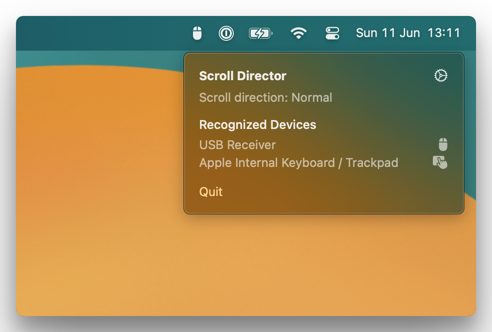

# ScrollDirector

> **Note**
> ScrollDirector is still in development, and bugs are likely.

Are you tired of macOS not having an independent setting for 'Natural Scrolling' on your Mouse and Trackpad? ScrollDirector will automatically disable natural scrolling whenever an external mouse is detected, and re-enable it when the mouse has been disconnected.

## Installation

Instructions coming soon!

## License

This project is licensed under the [MIT](https://choosealicense.com/licenses/mit/) license.
